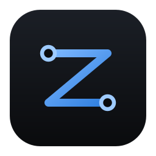

<div align="center">
  

  <h1>Zenoh Explorer</h1>

  <p><strong>See the mesh. Follow the route. Inspect the data.</strong></p>

  <p>
    A desktop workbench for understanding a live
    <a href="https://zenoh.io">Eclipse Zenoh</a> deployment—from router
    link-state and selected routes to key expressions, transports, and samples.
  </p>

  <p>
    <a href="https://github.com/farmblox/zenoh-explorer/releases/latest"><strong>Download the latest release</strong></a>
    ·
    <a href="#connect-to-a-network">Connect</a>
    ·
    <a href="#development">Develop</a>
    ·
    <a href="docs/architecture.md">Architecture</a>
  </p>

  <p>
    <a href="https://github.com/farmblox/zenoh-explorer/actions/workflows/ci.yml"></a>
    <a href="https://github.com/farmblox/zenoh-explorer/releases/latest"></a>
    <a href="LICENSE"></a>
    
  </p>
</div>

Zenoh already knows how your network is connected, what it declares, and where
it will forward data. Zenoh Explorer turns that operational state into one
coherent desktop tool. It is useful when a key expression does not match, a
peer disappears behind a router, a route takes an unexpected hop, or you simply
need to understand a deployment you did not build.

## What you can inspect

| Area                  | What it answers                                                                                                                                                                          |
| --------------------- | ---------------------------------------------------------------------------------------------------------------------------------------------------------------------------------------- |
| **Routed topology**   | Which routers, peers, and clients exist; which edges are in Zenoh link-state; the routing region and cost of each edge; and which router transports sit outside the current routing map. |
| **Live route trace**  | The successor decisions Zenoh reports from a selected node's router to the explorer's router, shown as an ordered path on the graph and in the node inspector.                           |
| **Nodes and regions** | What every visible node is attached to, which neighbours depend on it, what a gateway intentionally hides, and whether a router's admin space is readable.                               |
| **Keyspace**          | Observed keys, publishers, subscribers, queryables, queriers, tokens, storage coverage, ACL findings, and exact key-expression relationships.                                            |
| **Live data**         | Samples matching any key expression, including encoding, timestamps, priority, attachments, payload preview, and dropped-sample counts.                                                  |
| **Network tools**     | Queries, guarded publish/delete operations, scouting, raw admin-space browsing, effective router configuration, transport detail, and lifecycle diagnostics.                             |

The topology renderer is built for real meshes rather than small flowcharts. It
uses WebGL, a worker-driven layout, a virtualized node list, adaptive label
density, and stable drag positions so large networks stay interactive.

## Install

Download the installer for your platform from the
[latest release](https://github.com/farmblox/zenoh-explorer/releases/latest).

| Platform     | Available packages                    |
| ------------ | ------------------------------------- |
| macOS 10.15+ | Apple Silicon and Intel `.dmg` images |
| Linux x86_64 | AppImage, Debian package, and RPM     |
| Windows x64  | Setup executable and MSI              |

macOS releases are Developer ID signed and notarized. Release builds also carry
signed updater artifacts so update packages can be authenticated before they
are installed.

For an AppImage:

```bash
chmod +x Zenoh.Explorer_*_amd64.AppImage
./Zenoh.Explorer_*_amd64.AppImage
```

## Connect to a network

Open Zenoh Explorer, choose **Add a Connection**, and enter a router or peer.
The common case is:

```text
Transport  TCP
Address    localhost:7447
Mode       Client
```

Client mode is the default because it observes the deployment without joining
its peer-routing mesh. Multiple connections can stay open in separate tabs.

### Try it with a local router

If you do not have a Zenoh network available, start a router with Docker:

```bash
docker run --rm --init -p 7447:7447/tcp eclipse/zenoh:1.10.0 \
  --cfg='adminspace/enabled:true' \
  --adminspace-permissions r
```

Then connect Zenoh Explorer to `tcp/localhost:7447`.

### Topology visibility

Zenoh Explorer can always inspect its own direct transports. Seeing beyond the
first hop requires readable admin space on each router whose sessions and
routing state you want to inspect:

```json5
{
  adminspace: {
    enabled: true,
    permissions: {
      read: true,
      write: false,
    },
  },
}
```

The explorer queries each reachable router at `@/<router-id>/router`, then reads
its link-state and successor records. Peers and clients do **not** need to expose
their own admin space to be discovered through a router. When a router is known
but does not answer, the topology, node inspector, and status bar call out the
coverage gap instead of presenting a partial map as complete.

See Zenoh's documentation for the underlying
[admin-space model](https://zenoh.io/docs/manual/abstractions/#admin-space) and
[router configuration](https://zenoh.io/docs/manual/configuration/).

## Connections and safety

The connection editor supports TCP, QUIC, TLS over TCP, WebSocket, UDP, and Unix
domain sockets. TLS connections can use system trust or a custom CA, optionally
with a client certificate and mutual TLS. Advanced JSON5 is available when a
deployment needs Zenoh configuration that does not belong in the common form.

Saved profiles retain certificate paths but do not persist inline private keys.
Connection failures are diagnosed into actionable remedies for common endpoint,
timeout, certificate, and mTLS problems.

Sessions are read-only in the interface by default. Publishing or deleting
requires an explicit per-session **Allow writes** switch beside the action it
unlocks. Closing a session clears that permission.

## Development

You will need:

- Rust 1.95 or newer; `rust-toolchain.toml` selects the repository toolchain
- Node.js 22.12 or newer
- pnpm 10
- Your platform's [Tauri prerequisites](https://v2.tauri.app/start/prerequisites/)

```bash
git clone https://github.com/farmblox/zenoh-explorer.git
cd zenoh-explorer
pnpm install
pnpm dev
```

`pnpm dev` launches the Tauri application, not a browser-only version of the
frontend.

### Development network

The repository includes a three-router network with readable admin space,
link-state, regions, and seeded data:

```bash
pnpm testnet
pnpm testnet:seed
```

Connect to `tcp/localhost:7448`. Stop it with:

```bash
pnpm testnet:down
```

### Quality commands

```bash
pnpm check      # TypeScript, ESLint, formatting, Vitest, Clippy, and Rust tests
pnpm bindings   # regenerate TypeScript IPC types from Rust definitions
pnpm licenses:check # verify approved licenses and the bundled notice document
pnpm build      # create a production bundle for the current platform
pnpm e2e        # build and drive the real Tauri app through WebDriver
```

The Rust integration suite opens real loopback Zenoh networks to verify live
sample delivery, cross-router discovery, link-state costs, and successor-based
route tracing. Command tests cross the actual Tauri permission and
serialization boundary; frontend tests stub only the IPC edge.

The license check requires `cargo-deny` 0.20.2 and `cargo-about` 0.9.2. CI
installs the pinned versions automatically; contributors only need them when
running the compliance check locally or changing production dependencies.

## Architecture

```text
Zenoh network
    ↓
zenoh-explorer-core        network semantics, discovery, indexing, diagnostics
    ↓
tauri-plugin-zenoh-*       thin commands, events, channels, and permissions
    ↓
generated TypeScript IPC   Rust types exported with ts-rs
    ↓
React + Sigma              desktop UI and WebGL topology rendering
```

Network decisions live in `zenoh-explorer-core`; Tauri plugins translate them
across IPC, and React renders the result. This keeps Zenoh semantics testable
without a window and prevents a second implementation from drifting into the
frontend. Read the [architecture guide](docs/architecture.md) for the plugin
boundaries, event model, data flow, and frontend layering.

| Layer         | Technology                                     |
| ------------- | ---------------------------------------------- |
| Network core  | Rust, Zenoh 1.10, Tokio                        |
| Desktop shell | Tauri 2                                        |
| Interface     | React 19, TypeScript 6, Vite 8, Tailwind CSS 4 |
| Topology      | Sigma.js 3, Graphology, ForceAtlas2            |

## Contributing

Contributions are welcome. Start with [CONTRIBUTING.md](CONTRIBUTING.md) for the
setup, layering rules, command checklist, and testing strategy. Please follow
the [Code of Conduct](CODE_OF_CONDUCT.md).

- [Report a bug](https://github.com/farmblox/zenoh-explorer/issues/new?template=bug.yml)
- [Request a feature](https://github.com/farmblox/zenoh-explorer/issues/new?template=feature.yml)
- [Report a security issue](SECURITY.md)

Zenoh Explorer is still early software. If a discovery result looks wrong,
include the Zenoh version, deployment shape, and whether router admin space is
enabled in the issue.

## License

[Apache License 2.0](LICENSE), © Farmblox Inc.

Eclipse Zenoh is a trademark of the Eclipse Foundation. This project is not
affiliated with or endorsed by the Eclipse Foundation. The topology renderer
uses [Sigma.js](https://www.sigmajs.org/) and
[Graphology](https://graphology.github.io/), both under the MIT License.
